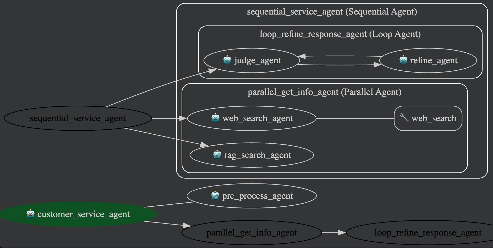

# Multi Agents

## Introduction
Build a collaborative system composed of multiple specialized agents using VeADK.

## Project Description
This example demonstrates a typical multi-agent collaboration scenario:
- **Hierarchical Architecture**: Main agent is responsible for task distribution, sub-agents handle specific execution
- **Professional Division**: Each agent focuses on a specific domain (such as storage management, data queries, etc.)
- **Tool Integration**: Integrate Volcano Engine services as tool capabilities
- **Collaboration Process**: Agents complete complex tasks through message passing and result sharing

Multi-agent structure:


## Prerequisites
1. **Enable Volcano Ark Model Service**: Visit [Ark console](https://exp.volcengine.com/ark?mode=chat)
2. **Prepare model_api_key**: Obtain **API Key** from the console
3. **Get AK, SK**: Refer to [User Guide](https://www.volcengine.com/docs/6291/65568?lang=zh) to obtain Volcano Engine access keys

## How to Run
### 1. Install veadk and agentkit python sdk, configure environment variables

```bash
uv pip install veadk-python
uv pip install agentkit-sdk-python
```

Set your model information, AK, and SK in `config.yaml`:
```yaml
model:
  agent:
    name: doubao-seed-1-6-251015
    api_key: XXXX

volcengine:
  access_key: XXXX
  secret_key: XXXX
```

### 2. Run local client
```bash
cd multi_agents
python main.py
```

### 3. Run veadk web client and access via browser at http://127.0.0.1:8000
```bash
cd ..
veadk web
```

### 4. Deploy to vefaas
> **Security Warning: Do not disable key authentication in production environments. Ensure `VEFAAS_ENABLE_KEY_AUTH` remains `true` (or unset, defaulting to enabled), and properly configure access keys and roles. Only temporarily disable authentication in local controlled debugging environments, and make sure to include warnings.**

```bash
cd multi_agents
# Run this step directly
export VEFAAS_ENABLE_KEY_AUTH=false
# Replace YOUR_AK with your own access key
export VOLCENGINE_ACCESS_KEY=YOUR_AK
# Replace YOUR_SK with your own secret key
export VOLCENGINE_SECRET_KEY=YOUR_SK
# Deploy application to cloud
veadk deploy --vefaas-app-name=multi-agents --use-adk-web --veapig-instance-name=<your veapig instance name> --iam-role "trn:iam::<your account id>:role/<your iam role name>"
```

### 5. Deploy to AgentKit and test with client.py

```bash
cd multi_agents
# Uncomment the following line in main.py to run the agentkit app server
# agent_server_app.run(host="0.0.0.0", port=8000)
agentkit config
agentkit launch
```

## Example Prompts
- Simple greeting:
> Hello, what help can you provide?

- Product consultation and recommendation:
> I want to buy a Volcano Engine virtual machine for image processing. Can you help me introduce which specification is more suitable for me?

- Order inquiry and problem handling:
> When will my order 12345 be shipped? I've been waiting for 3 days